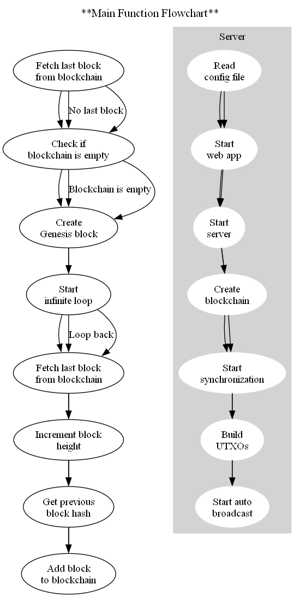
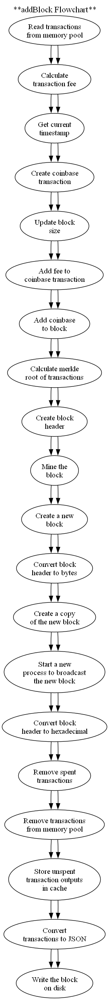
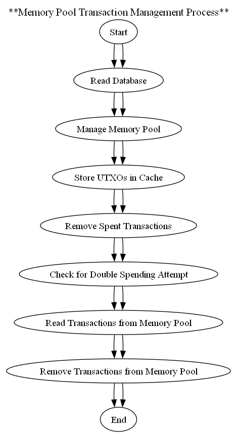
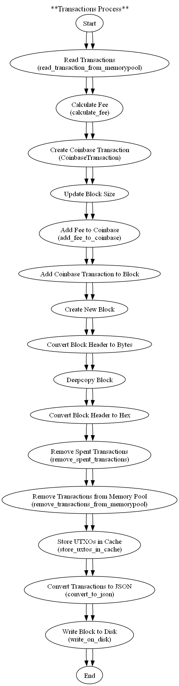
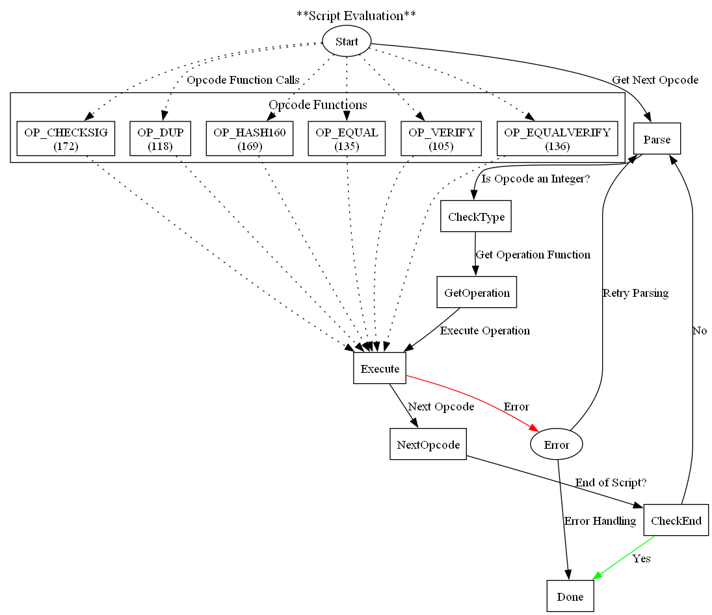
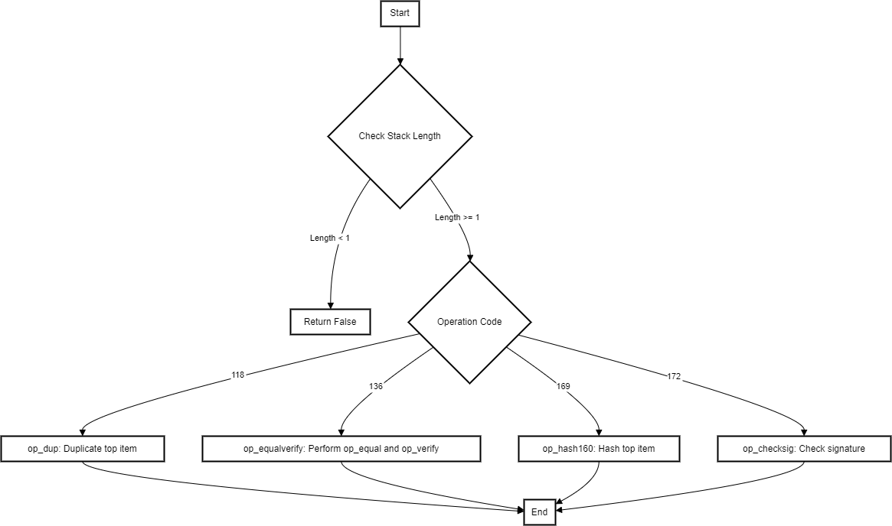

# Cryptocurrency Blockchain

This project is a cryptocurrency blockchain, similar to Bitcoin, implemented using the SHA256 algorithm. 

## Features

- **SHA256 Algorithm**: The blockchain uses the SHA256 algorithm for hashing.
- **Proof of Work (PoW) Mining**: The blockchain implements a PoW algorithm for mining new blocks.
- **Public Nodes**: The network consists of public nodes that participate in the blockchain.
- **Flask User Interface**: A Flask application is used as a user interface for sending and receiving transactions.

## Acknowledgments

This project wouldn't have been possible without the comprehensive course provided by [Codies Alert](https://www.codiesalert.com). Their in-depth tutorials and hands-on approach to teaching complex concepts made the learning process engaging and effective. A big thank you to the entire team at Codies Alert.

## Getting Started

These instructions will get you a copy of the project up and running on your local machine for development and testing purposes.

### Prerequisites

- Python 3.6 or higher
- Flask

### Installing

Clone the repository to your local machine:

```bash
git clone https://github.com/jonrebelo/Crypto_Blockchain.git
```

### Environment

```bash
conda create --name blockchain_apps charset-normalizer click colorama flask idna itsdangerous jinja2 markupsafe pillow pycryptodome qrcode requests urllib3 werkzeug
conda activate blockchain_apps
pip install flask-qrcode
```
### Instructions

1. With environment activated run blockchain.py
2. A flask server will spinup at 127.0.0.1:5900 (This can be changed in the config.ini if desired)
3. Mining will begin 
4. Navigate to 127.0.0.1:5900 in your browser to launch block explorer.
5. Transactions can be sent from the Wallet page. Check account file in the data folder for public addresses that have already been generated. 
6. Unconfirmed Transactions can be found in the Mempool page.
7. Mining will continue until the process is stopped.

If you want to generate your own private key and address:

1. With environment activated, run account.py.
2. The terminal will give you private and public keys. This will be recorded in the account file in the data folder. You can run account.py multiple times to generate multiple keys and addresses.
3. Go to Tx.py and replace the MINER_ADDRESS with your public address and PRIVATE_KEY with your private key. This will ensure mined units end up in your new wallet.

### Blockchain Functionality:

1. Main Process Flow:

The main() function in this blockchain implementation serves as the central control mechanism. Here's a step-by-step breakdown:

    Fetch Last Block: Retrieve the last block from the blockchain.

    Check Blockchain Empty: Check if the blockchain is empty.

    If the blockchain is empty, proceed to create a genesis block.

    Create Genesis Block: Generate and add the genesis block to the blockchain.

    Start Infinite Loop: Enter an infinite loop to continuously add new blocks to the blockchain.
    
    Fetch Last Block (Inside Loop): Again fetch the last block from the blockchain.
    
    Increment Block Height: Increment the block height for the new block.
    
    Get Previous Block Hash: Obtain the hash of the previous block.
    
    Add Block to Blockchain: Create and add a new block to the blockchain.

The flowchart visualizes these steps, including the setup process for the server and blockchain components:

    Configuration Setup: Read configuration from the file, set up parameters for local host, port, and simulation of Bitcoin.

    Server Setup: Start the web application process, initiate the server process, and synchronize blockchain data.

    Blockchain Setup: Create the blockchain object, start synchronization, and build the Unspent Transaction Outputs (UTXOs) database.

    Auto Broadcast Setup (Optional): If Bitcoin simulation is enabled, start the process for auto-broadcasting transactions.

 


2. Adding Blocks to Blockchain Flow

    Read transactions from memory pool: Gather transactions waiting to be added to the blockchain.

    Calculate transaction fee: Determine the fee associated with including transactions in the block.

    Get current timestamp: Obtain the current time to timestamp the block.

    Create coinbase transaction: Generate a special transaction, called the coinbase transaction, which rewards the miner with newly minted cryptocurrency.

    Update block size: Adjust the block size to accommodate the coinbase transaction.

    Add fee to coinbase transaction: Incorporate the transaction fee into the coinbase transaction.

    Add coinbase transaction to block: Include the coinbase transaction in the block.

    Calculate Merkle root of transactions: Compute a cryptographic hash of all transactions in the block to create the Merkle root.

    Create block header: Formulate a block header containing metadata such as version, previous block hash, Merkle root, timestamp, and other parameters.

    Mine the block: Perform the proof-of-work process to find a suitable nonce that satisfies the difficulty target.

    Create a new block: Assemble all components (block header, transactions, etc.) into a new block.

    Convert block header to bytes: Convert the block header into a format suitable for storage or transmission.

    Create a copy of the new block: Make a copy of the newly created block.

    Start a new process to broadcast the new block: Initiate a process to disseminate the newly mined block to other nodes in the network.

    Remove spent transactions: Eliminate transactions that have been included in the block from the list of unspent transactions.

    Remove transactions from memory pool: Clear the memory pool of transactions that have been added to the block.

    Store unspent transaction outputs in cache: Maintain a record of unspent transaction outputs for future reference.

    Convert transactions to JSON: Serialize transactions into JSON format for storage or transmission.

    Write the block on disk: Persist the newly mined block onto the blockchain ledger by writing it to disk.

 
 
 3. Mempool Flow:

 In a blockchain network, the mempool serves as a temporary storage space for pending transactions before they are included in a block and added to the blockchain. Here's how this specific mempool works:

    Start: The process begins.

    Read Database: The system reads the blockchain database to gather information about existing blocks.

    Manage Memory Pool (Mempool): Transactions are managed within the mempool, where they await processing.

    Store UTXOs in Cache: Unspent Transaction Outputs (UTXOs) are stored in a cache for quick reference during transaction processing.

    Remove Spent Transactions: Transactions that have been included in blocks and spent are removed from the UTXO set.

    Check for Double Spending Attempt: The system checks if any transaction in the mempool is attempting to spend the same UTXO more than once, which would indicate a double spending attempt.

    Read Transactions from Memory Pool: Pending transactions are read from the mempool, and potential double spending attempts are filtered out.

    Remove Transactions from Memory Pool: Processed transactions are removed from the mempool, as they have been included in blocks and are no longer pending.

    End: The process concludes.



The mempool plays a crucial role in maintaining the integrity and efficiency of the blockchain network by ensuring that valid transactions are processed and added to the blockchain in a timely manner, while preventing double spending and other fraudulent activities.


4. Transactions Flow:

At a high level, the process of processing transactions in a blockchain involves several steps:

    Read Transactions: Read transactions from the memory pool, ensuring there are no double spending attempts.

    Calculate Fee: Calculate the transaction fee for including transactions in the block.

    Create Coinbase Transaction: Create a Coinbase transaction, which rewards the miner with newly minted coins.

    Update Block Size: Update the block size to accommodate the transactions, including the Coinbase transaction.

    Add Fee to Coinbase: Add the transaction fee to the Coinbase transaction.

    Add Coinbase to Block: Add the Coinbase transaction to the block's list of transactions.

    Create New Block: Assemble a new block containing the transactions, along with the block header.

    Convert Block Header to Bytes: Convert the block header to bytes for hashing.

    Deepcopy Block: Create a deep copy of the new block for further processing.

    Convert Block Header to Hex: Convert the block header to hexadecimal format.

    Remove Spent Transactions: Remove spent transactions from the memory pool to prevent double spending.

    Remove Transactions from Memory Pool: Remove processed transactions from the memory pool.

    Store UTXOs in Cache: Store unspent transaction outputs (UTXOs) in cache for efficient access.

    Convert Transactions to JSON: Convert transactions and the block header to JSON format for storage or transmission.

    Write Block to Disk: Write the assembled block to disk for persistence and distribution.



5. Transaction Verification Flow:

Transaction Creation:
    Input: The transaction references previous outputs that the sender wants to spend. Each input includes a reference to a previous transaction output and an unlocking script (scriptSig) that will be used to prove ownership.

    Output: Specifies the destination address and the amount of Bitcoin to be transferred. Each output includes a locking script (scriptPubKey) that sets the conditions under which the output can be spent.

Broadcasting:

    The created transaction is broadcast to the Bitcoin network. This means it is sent to nodes in the network, which then relay it further.

Verification by Nodes:

    Nodes in the network verify the transaction before it is included in a block. This involves several checks, including signature verification and ensuring that the referenced outputs have not already been spent.

Script Execution:

    When a transaction is being verified, the script system plays a crucial role. Here’s a step-by-step breakdown:

        a. Combining Scripts:

        - The unlocking script (scriptSig) from the transaction input and the locking script (scriptPubKey) from the referenced output are combined.

        - The combined script is then executed by the Bitcoin Script engine.

        b. Stack-Based Evaluation:
        - The script is executed in a stack-based manner, where commands (opcodes) are processed one by one.

        - Data items and intermediate results are pushed to and popped from the stack.

        c. Execution Flow:
        - Parsing: Each command in the script is parsed. If the command is an integer, it’s treated as an opcode and the corresponding operation is executed.

        - Operations: Depending on the opcode, various operations are performed, such as duplicating the top stack item (OP_DUP), hashing the top item (OP_HASH160), comparing items (OP_EQUAL), and verifying signatures (OP_CHECKSIG).

        - Error Handling: If any operation fails (e.g., insufficient items on the stack, signature verification fails), the script execution is halted, and the transaction is deemed invalid.

Signature Verification:

    OP_CHECKSIG: This operation is crucial for validating that the person spending the funds has the right to do so. It verifies that the signature provided in the unlocking script matches the public key and the transaction data.

    Verification Process: The public key and the signature are popped from the stack. The signature is checked against the transaction hash using the public key. If the verification passes, 1 is pushed onto the stack; otherwise, 0 is pushed.

Validation Outcome:

    After all commands have been processed, the stack should have a single item: 1 (true). This indicates that the script execution was successful, and thus the transaction is valid.

    If the stack is empty or the top item is 0 (false), the transaction is invalid.

Inclusion in a Block:

    If the transaction is valid, it gets included in a block by a miner.
    The block is then added to the blockchain, and the transaction is considered confirmed.

Consensus:

    Nodes in the network reach a consensus on the validity of transactions and blocks. A valid transaction must be accepted by a majority of nodes and eventually included in a block that becomes part of the longest chain in the blockchain.



6. Script Execution Flow:

    scriptSig (Unlocking Script): This is provided by the spender. Example: [Signature] [PublicKey]

    scriptPubKey (Locking Script): This is specified in the output being spent. Example: OP_DUP OP_HASH160 [PublicKeyHash] OP_EQUALVERIFY OP_CHECKSIG

When verifying the transaction, these scripts are combined and executed as follows:

Combine Scripts:

    Combined script: [Signature] [PublicKey] OP_DUP OP_HASH160 [PublicKeyHash] OP_EQUALVERIFY OP_CHECKSIG

Execute Commands:

    Push Signature: [Signature] is pushed onto the stack.
    Push PublicKey: [PublicKey] is pushed onto the stack.
    OP_DUP: Duplicates the top item. Stack: [PublicKey, PublicKey]
    OP_HASH160: Hashes the top item. Stack: [PublicKey, PublicKeyHash]
    Push PublicKeyHash: [PublicKeyHash] from the scriptPubKey is pushed onto the stack.
    OP_EQUALVERIFY: Compares the top two items for equality and removes them if they are equal. If not equal, the script fails. Stack: [PublicKey]
    OP_CHECKSIG: Verifies the signature against the public key and the transaction data. If valid, pushes 1 onto the stack. Stack: [1]

Final Stack Check:

    If the final stack has 1 on top, the transaction is valid.
    If the final stack is empty or the top item is 0, the transaction is invalid.

This process ensures that only the rightful owner of the funds (i.e., the one who can provide the correct signature) can spend them.

